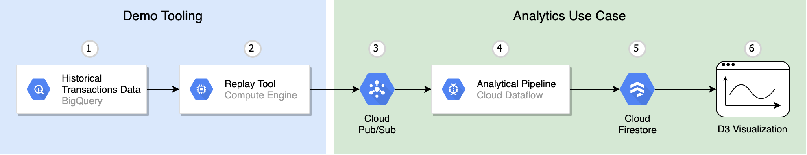

# Streaming FSI Showcase



## Stock Trades
### Prepare stock data

Copy stock trades historical data
```shell script
export PROJECT=$(gcloud config get-value project 2> /dev/null)
bq cp ethereum-streaming-dev:polygon.trades $PROJECT:polygon.trades
```

### AI Notebook

Clone repository in AI notebooks environment
Run bq.ipynb notebook

### Replay tool

Create topic
```shell script
gcloud pubsub topics create polygon.trades --project=$PROJECT
```

Create temp resources and start a VM running docker container
```shell script
cd ./replay
bash ./create_temp_resources.sh
export TEMP_RESOURCE_NAME=$(./get_temp_resource_name.sh)
gcloud compute instances create-with-container replay-tool \
  --zone=us-central1-a \
  --machine-type=n1-standard-1 \
  --scopes=https://www.googleapis.com/auth/bigquery,https://www.googleapis.com/auth/pubsub,https://www.googleapis.com/auth/servicecontrol,https://www.googleapis.com/auth/service.management.readonly,https://www.googleapis.com/auth/logging.write,https://www.googleapis.com/auth/monitoring.write,https://www.googleapis.com/auth/trace.append,https://www.googleapis.com/auth/devstorage.read_write \
  --container-image=blockchainetl/bigquery-to-pubsub:0.0.1 \
  --container-restart-policy=always \
  --container-arg=--bigquery-table \
  --container-arg=$PROJECT.polygon.trades \
  --container-arg=--timestamp-field \
  --container-arg=ts \
  --container-arg=--start-timestamp \
  --container-arg=2018-12-31T18:00:00 \
  --container-arg=--end-timestamp \
  --container-arg=2019-01-01T00:00:00 \
  --container-arg=--batch-size-in-seconds \
  --container-arg=1800 \
  --container-arg=--replay-rate \
  --container-arg=0.1 \
  --container-arg=--pubsub-topic \
  --container-arg=projects/$PROJECT/topics/polygon.trades \
  --container-arg=--temp-bigquery-dataset \
  --container-arg=$TEMP_RESOURCE_NAME \
  --container-arg=--temp-bucket \
  --container-arg=$TEMP_RESOURCE_NAME
```

### Dataflow

Create subscription
```shell script
gcloud pubsub subscriptions create polygon.trades --topic=polygon.trades --ack-deadline=60
```

#### Enable Dataflow API in console
go to [APIs page](https://console.developers.google.com/apis/api/dataflow.googleapis.com/overview)
search for Dataflow and click - "Enable"
#### Enable Firestore
go to [Firestore Page](https://console.cloud.google.com/firestore/welcome)
select Firestore in Native mode

#### Start Dataflow pipeline
```shell script
cd ./dataflow
mvn clean package
java -cp target/ethereum-streaming-analytics-bundled-1.0-SNAPSHOT.jar com.google.allenday.TransactionMetricsPipeline \
--runner=org.apache.beam.runners.dataflow.DataflowRunner \
--project=$PROJECT \
--inputDataTopicOrSubscription=projects/$PROJECT/topics/polygon.trades \
--firestoreCollection=polygon_trades \
--streaming=true \
--jobName=polygon-candlestick-demo \
--inputType=polygon
```

### Charts

#### Firestore configuration
Go to [Firestore console](https://console.firebase.google.com/)
- add your project to Firebase Console
- add new application named "charts"
- copy Firebase config
- setup permissions on database
```
rules_version = '2';
service cloud.firestore {
  match /databases/{database}/documents {
    match /polygon_trades/{documentId} {
     allow read;
    }
    match /ethereum_transactions/{documentId} {
     allow read;
    }
    match /{document=**} {
      allow read, write: if false;
    }
  }
}
```

#### JS Application
- modify `charts/csmain.js` by putting your Firebase config inside
- create public bucket
```shell script
export PUBLIC_BUCKET_NAME=$PROJECT_public
gsutil mb gs://$PUBLIC_BUCKET_NAME
gsutil iam ch allUsers:objectViewer gs://$PUBLIC_BUCKET_NAME
```
- upload files from `charts` directory to public bucket
- check real-time chart

## Ethereum transactions

#### Create subscription to public Ethereum topic

```shell script
gcloud pubsub subscriptions create crypto_ethereum.transactions \
  --topic=crypto_ethereum.transactions \
  --topic-project=crypto-public-data \
  --ack-deadline=60
```
#### Start Dataflow pipeline

```shell script
cd ./dataflow
java -cp target/ethereum-streaming-analytics-bundled-1.0-SNAPSHOT.jar com.google.allenday.TransactionMetricsPipeline \
--runner=org.apache.beam.runners.dataflow.DataflowRunner \
--project=$PROJECT \
--inputDataTopicOrSubscription=projects/$PROJECT/subscriptions/crypto_ethereum.transactions \
--firestoreCollection=ethereum_transactions \
--streaming=true \
--jobName=ethereum-candlestick-demo \
--inputType=ethereum
```